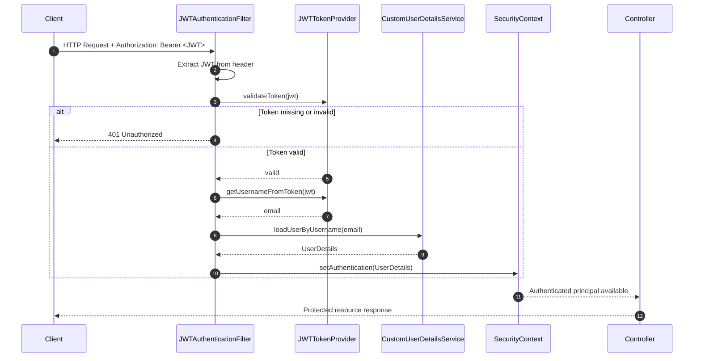
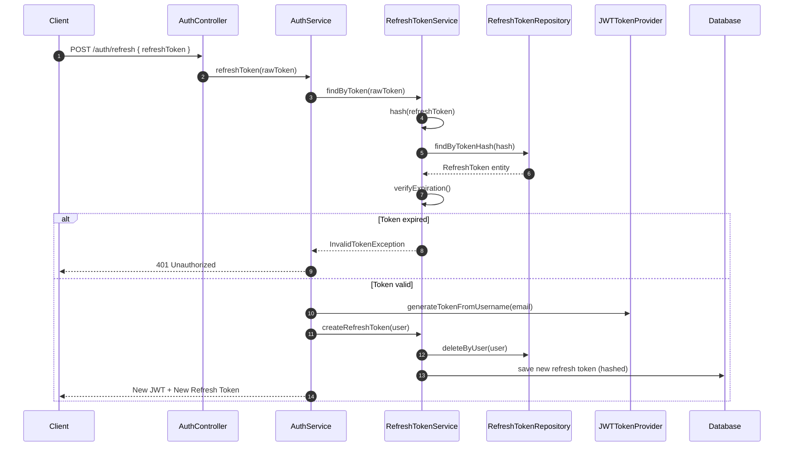

# Authentication diagrams

This file contains Mermaid sequence diagrams that describe the authentication flows used by the project (refresh-token exchange and JWT validation filter).

## JWT request filter and validation

## Refresh token exchange

## Notes

- These diagrams reflect the implementation in `src/main/java/com/spring/memory`.
- See `AuthController`, `RefreshTokenService`, `JWTAuthenticationFilter`, and `JWTTokenProvider` for the concrete code paths.
